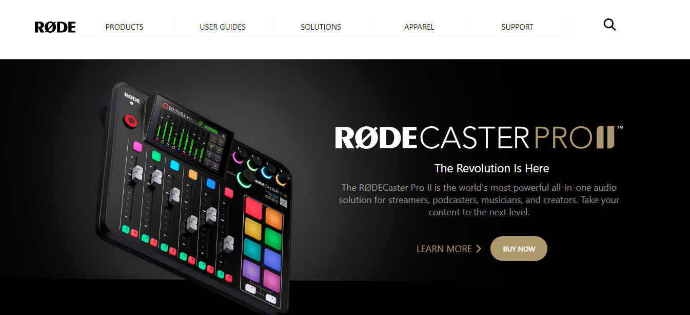

## My Name is Ajay.
## Final from the front end side of web dev bootcamp - Ineuron
# [Live website Link](https://aj-rode.netlify.app/)
### Completed the final project from the front end projects, this was to create the clone of Rode website using tailwind CSS. I used to think that Tailwind CSS is very complicated, but after completing three projects fro this, I understood that it's not, we just have to uderstand the classes properly and rest everything is the same as CSS.

### Time Taken to complete the prject: 5 hours.

### Website Preview:-

